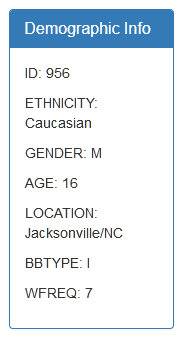
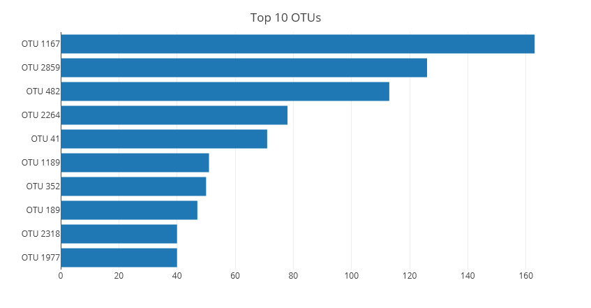
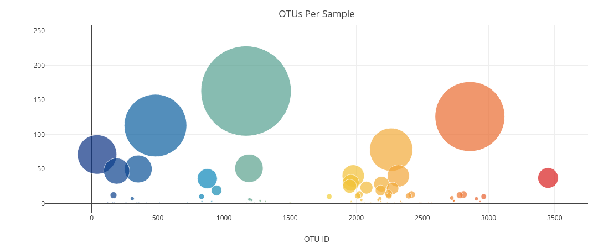

# Prompt
Create an interactive dashboard to explore the dataset that catalogs the microbes that colonize human navels.

# Dependencies
- Javascript
- D3
- Plotly
- HTML5
- Bootstrap

# Process

1. Initial Setup

    The dashboard will be made of the following:
      - Bootstrap Jumbotron
      - Id Dropdown
      - Demographic Info Panel
      - Bar Plot
      - Bubble Plot

    Bootstrap will be used to arrange the elements on the page. Each component requires its own div within the `index.html` for the plotly charts and javascript functions to         reference.

    Since the data source won't change for the project the variable for it will be set up as a const as such
    ```
    const dataset = d3.json("data/samples.json");
    ```
    The dataset variable will be used throughout the various functions to provide the metadata for the plots and dropdowns.

2. Interactivity  
    In order to be built dynamically each component on the dashboard uses the variable i. The variable gets defined when the change event for the drop down menu is triggered. Another variable id holds every test subject id. 
    ```
    function handleChange() {
    let id = dropDown.property("value");
    buildPlots(id);
    };
    ```
    
   The `buildPlots(id)` function uses the id variable to help generate the i value. All of the test subject id numbers are stored in the names array. Using the value generated from `dropDown.property("value")` we can search the for the index position of that id value using `indexOf(id)`. For example one of the id numbers is 940 and when that is passed through the index function we get the an position of zero. Each array within the JSON file is arranged in the same order. So getting the index of the id in the names array will allow us to access data from the samples array at the same index position. The functions to build all of the dashboard elements are within `buildPlots()` and is also in `handleChange()`. So when a change event happens buildPlots is triggered which then triggers each function that builds the dashboard elements.
   
3. Id Dropdown

    To add all the subject ids at once D3 is used to manipulate the DOM. The dropdown is selected using `d3.select` and then various function are chained to that selection. The subject ids are loaded from the JSON file and then they are appended to a list along with the value attribute. It looks like the following:
    ```
    dropDown.selectAll("option")
      .data(data.names)
      .enter()
      .append("option")
      .text(d => d)
      .attr("value", d => d);
    ```
4. Demographic Panel

    D3 is used to select the id for the panel from the HTML. `panel.html("");` is used to make sure any old information gets dropped from the panel before it gets generated. The demographic info in stored with the metadata array as key value pairs. The constructor `Object.entries(data.metadata[i])` is used load the data for the current i value in use. `forEach()` is used to cycle through all seven categories of information within the object. Each one gets appended to a p tag and formatted. Using the p tag will allow the text to be on its own line.
    ```
    forEach(([key, value]) =>{panel.append("p").text(`${key.toUpperCase()}: ${value}`)});
    ```
    To help differentiate between the key and value `toUpperCase()` is applied to the key.

    
  
5. Bar Plot  

    The bar plot will show the count for each OTU or Operational Taxonomic Unit. Each person in study will have different OTUs. To plot this data we need to read in data from the samples array. `then()` ensure that the data is available to be processed before any other parts of the script proceed. Each object within the samples array consists of four parts. The subject id, otu id, numerical values, and otu labels. Since the subject id is being handle with another function all we need to define are the otu id, numerical values, and otu labels.
    
    Plotly will be used to build the charts. It will streamline the process. The main concern is defining x and y axes. We are only interested in the top ten so `slice()` is used on the otu id and then reversed to have them appear in descending order. `map()` links the otu id to each bar and renders the name along the y axis. The x axis is defined with the sample values array. The full name of the bacteria sample is defined in the otu labels. These names are applied to each bar as hover text. Making the chart more interactive and informative.
    
    Formatting such as a title and bar orientation are applied as necessary. Ploty is dependent on an id living within the HTML. Without this plotly doesn't know where to render that chart.
    
    
    
6. Bubble Plot

    The position on the x axis for each bubble is its otu id. This is defined by using `map()` to extract the key/value pairs from each object in the samples array. That looks like the following:
    ```
    let bubbleX = data.samples.map((d) => d.otu_ids);
    ```
    This process is repeated for any other necessary data. The i varible from  `buildPlots()` is used once again to tie the bubble to a test subject id. Size and color for the markers are set within a key that is specific to bubble charts in plotly.
  
    ```
    marker: {
              size: bubbleMarker[i],
              color: bubbleColor[i],
              colorscale: 'Portland',
            }
    ```
   The size of each bubble correlates to the count for each otu and the otu id determines its color along the color scale. To make the plot more informative hover text is applied to each bubble. This text was defined during the initial data variable setup. The process for getting the chart to render in the correct location is the same as the bar chart. 
   
    
 
### **To see the dashboard in action visit this link  [Biodiversity Dashboard](https://npvoravong.github.io/biodiversity/)**
